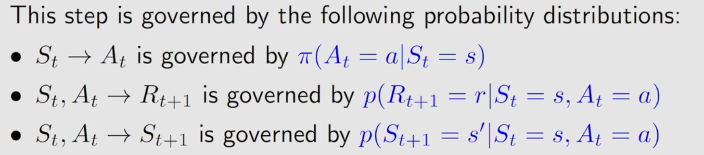
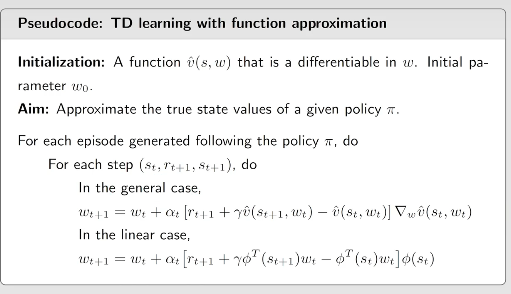
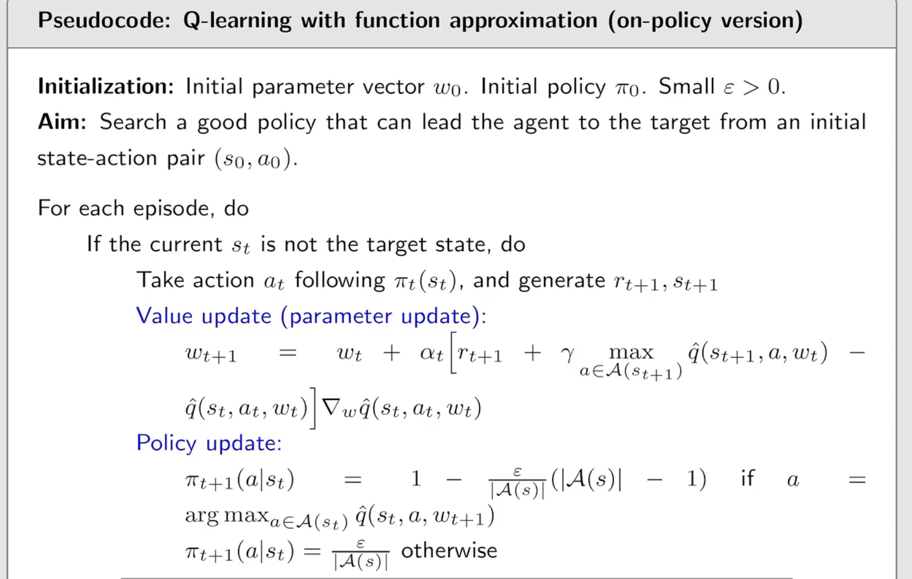
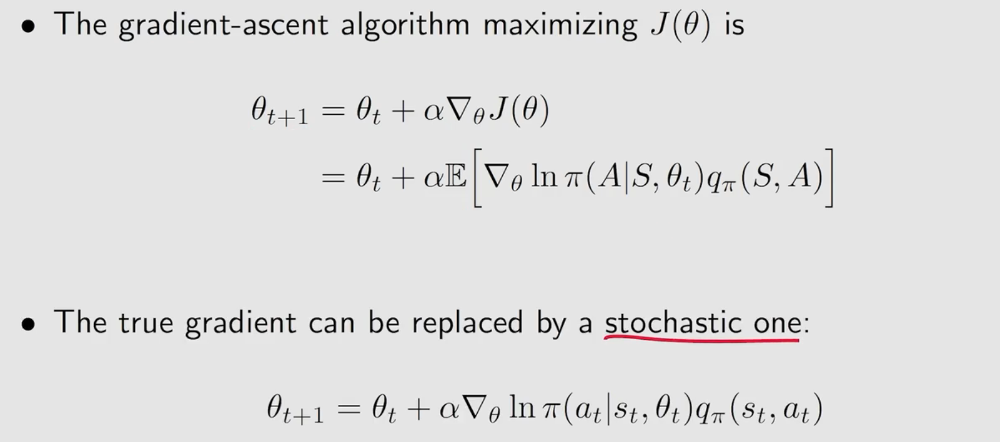
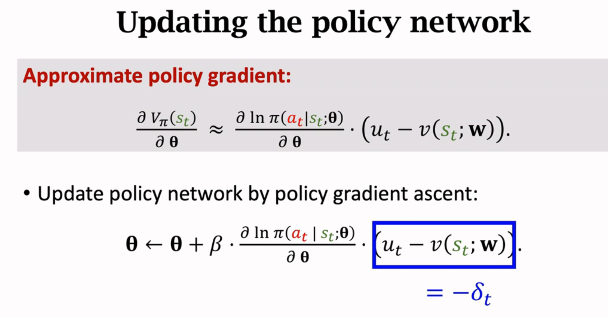
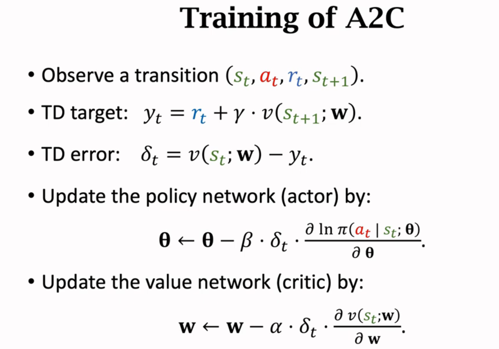
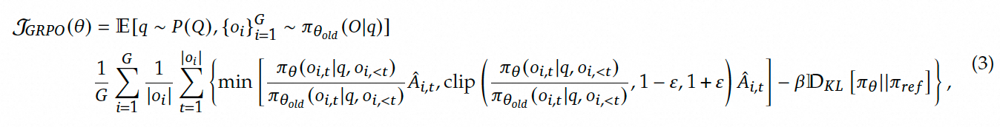
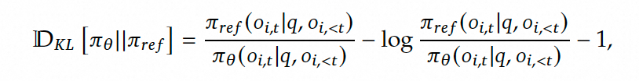

# RL-study
强化学习

脉络图


# ch1 basic

## 概念

**Action:A** 

**State:S**

**State transition probability**：概率

p(s2|s1,a2)=1

p(s_i|s1,a2)=0   i!=2

**Policy:pi**

某个S将采取的A

pi(a1|s1)=0

pi(a2|s1)=0.5

pi(a3|s1)=0.5

pi(a4|s1)=0

pi(a5|s1)=0

**Tabular representation**

表格形式：只能表示deterministic，而不是stochastic


**Reward**

代表某一action的评价数

由当前state和action决定

**trajectory**

state-action-reward **chain**

**return**

沿着trajectory得到的reward的总和

**discounted return:gamma**

由于trajectory无限长，引入衰减系数gamma

gamma趋于1，更关注near future

gamma趋于0，更关注far future

**episode**

有限步

continuing tasks：没有终止状态，无限运行

本课将target state作为normal state，agent可以离开target 并重新进入

## Markov decision process MDP

M:Markov property

D:policy

P:set probability

**set**

S，A(s)，R(s,a)

**probability**

State transition probability：p(s'|s,a)       

Reward probability：p(r|s.a)

**policy**

pi(a|s)

**Markov property**

无记忆性

p(s_t+1|a_t+1,s_t.....a_1,s_0)=p(s_t+1|a_t+1,s_t)

p(r_t+1|a_t+1,r_t.....a_1,r_0)=p(r_t+1|a_t+1,r_t)

# ch2 BE

v_i表示从s_i开始获得的return

某一状态的return 依赖于其他状态的return

## state value:V

state value就是状态s未来的return的期望

S_t----A_t--->R_t，S_t+1---A_t+1--->R_t+1，S_t+2----A_t-+2-->R_t+2,,,

这些跳跃由probability决定


$$
G_t=R_{t+1}+\gamma R_{t+2}+\gamma^{2} R_{t+2}+........
$$

$$
% 期望
v_\pi(s)= \mathbb{E}[G_t|S_t=s]
$$

state value和state和policy有关

return是对单个trajectory求值

state value是对多个trajectory求期望

## Bellman equation BE推导

贝尔曼公式


immediate reward mean


future reward mean


**公式**

实际上每个s都有一个state value，因此有很多个state value；因此可以联立解


$$
\pi(a|s)是policy，如果是固定的，整个式子就是Policy-evaluation
\\括号里的蓝色式子是model，有model-base和model-free
$$
**例子**

可以直观看出来也可以根据公式算出

可以算出所有s的state value，哪个大就说明s好

另外也可以代入不同的policy，判断同一s的state value，大的那个policy好


**矩阵向量形式 matrix vector form**


**policy evaluation：给定policy，得到state value**

**iterative solution**

可以证明当k无穷时，v_k趋于v_pi


## Action value

action value是s选择action后获得的未来return的期望
$$
q_\pi(s,a)=\mathbb E[G_t|S_t=s,A_t=a]
$$


## summary


# ch3 BOE

**improve policy：use action value**

选择action value最大的action作为policy

## optimal policy

$$
v_{\pi1}(s)>v_{\pi2}(s) \quad for \quad all\quad s \in S
$$

$$
此时可以说{\pi_1}\quad better \quad than \quad {\pi_2}
$$

optimal policy就是对所有策略上式都成立

## Bellman optimality equation BOE推导

**贝尔曼最优公式：policy不确定，需要求解**

element wise form：向量元素对应相乘
$$
v(s)=\underset{\pi}{max}\sum_{a}\pi(a|s)(\sum_{r}p(r|s,a)r+\gamma\sum_{s\prime}p(s\prime|s,a)v(s\prime)),\quad \forall \in S
\\=\underset{\pi}{max}\sum_a\pi(a|s)q(s,a) \quad s \in S
$$
matrix-vector form
$$
v=\underset{\pi}{max}(r_{\pi}+\gamma P_{\pi}v)
$$
**有两个未知数v和pi，如何求解贝尔曼最优公式？**

很简单，先求右式子的max得到pi，再求解整个式子
$$
\underset{\pi}{max}\sum_a\pi(a|s)q(s,a) \quad s \in S
$$
求解上式，只要对应a最大的pi为1
$$
\underset{\pi}{max}\sum_a\pi(a|s)q(s,a)=\underset{a\in A(s)}{max}q(s,a)
\\ \pi(a|s)=
\left\{
\begin{aligned}
&1 \quad a=a^*
\\&0 \quad a\ne a^*
\end{aligned}
\right.
$$
将BOE变为关于v的函数
$$
v=f(v)=\underset{\pi}{max}(r_\pi+\gamma P_\pi v)
$$

## contraction mapping theorem

**fixed point**: 

f(x)=x

**contraction mapping**（or contraction function):

收缩映射
$$
||f(x_1)-f(x_2)||\le\gamma ||x_1-x_2||
\\ where \quad \gamma \in (0,1)
$$
**contraction mapping theorem**

任何等式满足f(x)=x，而且f是一个contraction mapping，则有以下性质：

1：exist fixed point x*

2：x*是unique

3：趋于无穷时，x会收敛到x*****，可以迭代式求解x*

## contraction property of BOE

对BOE
$$
v=f(v)=\underset{\pi}{max}(r_\pi+\gamma P_\pi v)
$$
有（书中有证明）
$$
||f(x_1)-f(x_2)||\le\gamma ||x_1-x_2||
\\ \gamma \quad is \quad the \quad discount \quad rate
$$
因此BOE有contraction property  1，2，3

**policy optimality**

BOE实际上是特殊条件下的BE
$$
v^*=\underset{\pi}{max}(r_\pi+\gamma P_\pi v^*)
\\ \pi^*=\underset{\pi}{argmax}(r_\pi+\gamma P_\pi v^*)
\\v^*=r_{\pi^*}+\gamma P_{\pi^*}v^*
$$
证明得到
$$
v^*  \quad is  \quad the \quad  largest  \quad state \quad  value
\\ \pi^* \quad  is \quad  the \quad  optimal \quad  policy
$$
**optimal policy**
$$
\\ \pi^*(a|s)=
\left\{
\begin{aligned}
&1 \quad a=a^*(s)
\\&0 \quad a\ne a^*(s)
\end{aligned}
\right.
$$

## **analyzing optimal policies**

红色的量是model提供的已知的（概率）

黑色的量是未知需要求解的


gamma越小越短视

gamma越大越长视

forbidden reward惩罚越重就会绕开forbidden area

单纯缩放，调整所有的r，不会改变策略；因为optimal policies关注的是相对reward

**optimal policies由gamma和reward共同约束**

## summary


# ch4 value/policy iteration

##  value iteration

给定state value
$$
v=f(v)=\underset{\pi}{max}(r_\pi+\gamma P_\pi v)
\\ v_{k+1}=f(v_k)=\underset{\pi}{max}(r_\pi+\gamma P_\pi v_k)\quad k=1,2,3...
$$
**step1: policy update**
$$
\pi_{k+1}=\underset{\pi}{argmax}(r_\pi+\gamma P_\pi v_k)
$$
**step2: value update**
$$
v_{k+1}=r_{\pi_{k+1}}+\gamma P_{\pi_{k+1}} v_k
$$
**伪代码**


## policy iteration

给定policy

**step1: policy evaluation （PE）**

计算state value可以用closed-form（矩阵算法）或iterative solution（是一个迭代算法）
$$
v_{\pi_{k}}=r_{\pi_{k}}+\gamma P_{\pi_{k}} v_{\pi_{k}}
$$
**step2: policy improvement （PI）**
$$
\pi_{k+1}=\underset{\pi}{argmax}(r_\pi+\gamma P_\pi v_{\pi_{k}})
$$
**伪代码**


**举例：grid world越靠近target area的策略越快变好，因为state value依赖其他的state value，只有其他的state value变好后自己的state value才会变好**

## truncated policy iteration 

**model-based  MBRL**

**policy iteration和value iteration比较**


step4会出现
$$
v_{\pi_1}\ge v_{1}
$$
**解释**

truncated仅进行j步

policy iteration 理论上不存在


**伪代码**


# ch5 Monte Carlo Learning

**model-free**  

no precise distribution

采样估计
$$
\mathbb E[X]\approx \overline{x}=\frac{1}{N}\sum_{j=1}^Nx_j
$$

## MC Basic


$$
g^{i} \ \quad is \quad a \quad sample \quad of \quad G_t
\\q_\pi(s,a)=\mathbb E[G_t|S_t=s,A_t=a]\approx \frac{1}{N}\sum_{i=1}^Ng^{i}(s,a)
$$
when model is unavailable , use data

in RL we call **experience**

step1和policy iteration不同，MC是直接得到q

**policy iteration先计算state value，之后得到action value**

**MC 是直接估计action value**


**伪代码**


episode越短，只有离target area最近的state value非零

episode变长，离target area越远的state value逐渐增大

## MC Exploring Starts

**visit**

MC Exploring Starts仅用一次episode


**高效使用数据**

1 **first-visit method**

仅估计第一次出现的(s,a)pair的return

2 **every-visit method**

每出现一次(s,a)pair就估计一次return，改进策略

**高效更新策略**

1 得到所有的episode的average来估计action value

2 每得到一个episode的return就估计action value

**Generalized policy iteration GPI**

在policy evaluation 和policy improvement不断切换，而且进行有限次迭代计算state value

**伪代码**

first-visit method


细节：逆序计算（为了利用已经计算的数据）

缺陷：很难找到拥有每个(s,a)开头的episode

## MC e-Greedy

**stocastic**

soft policy：每个action都有概率选择

greedy policy


e-greedy 可以balance exploitation(充分利用) and exploration(充分探索)

e=1，more exploration，最优性越差

e=0，more exploitation，最优性越好

not require exploring starts

**技巧**

当e很小的时候是consistent，因为它的策略和最优策略是相同的；

但当e逐渐增大时，策略和最优策略差别越来越大

使用MC e-Greedy的技巧：让e取较大的值，充分发挥exploration，接着逐渐减少e，最后得到最优策略

**伪代码**

every-visit method：下面没有does not appear


# ch6 stochastic approximation

## **mean estimate**

若收集全部样本再求mean，太费时了
$$
\mathbb E[X]\approx \overline{x}=\frac{1}{N}\sum_{j=1}^Nx_j
$$
**incremental and iterative**

每采样一个样本就计算mean


下面的是一种stochastic approximation也是一种stochastic gradient descent
$$
mean\quad estimate  \quad algorithm
\\w_{k+1}=w_k-\alpha_k (w_k-x_k)
$$

## Robbins-Monro  RM

求解
$$
g的表达式可以不知道
\\g(w)=0
$$
最优解是
$$
w^*
$$
第k次的解
$$
w_k
$$
RM算法求解
$$
w_{k+1}=w_k-a_k\widetilde{g}(w_k,\eta_k)
$$
g~是g的第k次的noisy obsevation
$$
\widetilde{g}(w_k,\eta_k)=g(w_k)+\eta_k
$$


1：要求递增且递增率有限

2：系数一次和发散，说明a收敛不能太快；系数平方和收敛，说明a收敛至0

例如 a= 1/k

3：均值为0且方差有界


$$
假设g(w)=w-\mathbb E(X)\
\\
\\ \widetilde{g}(w,x)=w-x
\\
\\\widetilde{g}(w,\eta)=w-x=g(w)-\eta
\\
\\mean\quad estimate是特殊的RM算法
\\w_{k+1}=w_k-\alpha_k\widetilde{g}(w_k,\eta_k)=w_k-\alpha_k(w_k-x_k)
$$

## Stochastic gradient descent

**求解问题**
$$
\underset{w}{min}\quad J(w)=\mathbb E[f(w,X)]
$$
GD：沿着梯度下降的方向更新参数w
$$
w_{k+1}=w_k-\alpha_k\nabla_w\mathbb E[f(w_k,X)]
\\\quad\quad\quad\quad=w_k-\alpha_k \mathbb E[\nabla_wf(w_k,X)]
$$
BGD
$$
\mathbb E[\nabla_wf(w_k,X)]\approx \frac{1}{n}\sum_{i=1}^n\nabla_wf(w_k,x_i)
\\w_{k+1}=w_k-\alpha_k \frac{1}{n}\sum_{i=1}^n\nabla_wf(w_k,x_i)
$$
SGD
$$
w_{k+1}=w_k-\alpha_k\nabla_wf(w_k,x_k)
$$
**an example**
$$
\underset{w}{min}\quad J(w)=\mathbb E[f(w,X)]=
\mathbb E[\frac{1}{2}||w-X||^2]
$$
GD
$$
true\quad gradient
\\w_{k+1}=w_k-\alpha_k\nabla_w J(w_k)
\\\quad\quad\quad\quad=w_k-\alpha_k \mathbb E[\nabla_wf(w_k,X)]
\\\quad\quad=w_k-\alpha_k \mathbb E[w_k-X]
$$
SGD
$$
stochastic\quad gradient
\\mean\quad estimate是特殊的SGD算法
\\w_{k+1}=w_k-\alpha_k\nabla_wf(w_k,x_k)=w_k-\alpha_k(w_k-x_k)
$$
**show that SGD is a special RM algorithm**
$$
\underset{w}{min}\quad J(w)=\mathbb E[f(w,X)]
\\g(w)=\nabla_wJ(w)=\mathbb E[\nabla_wf(w,X)]=0
\\\widetilde g是测量数据x，含噪声
\\\widetilde g(w,\eta)=\nabla_w f(w,x)
\\
\\=\mathbb E[\nabla_wf(w,X)]+\nabla_w f(w,x)-\mathbb E[\nabla_wf(w,X)]
\\ 
\\SGD是特殊的RM算法
\\w_{k+1}=w_k-\alpha_k\widetilde g(w_k,\eta_k)=w_k-a_k\nabla_wf(w_k,x_k)
$$
**convergence pattern**

当w越接近最优解时，随机性越大

当w越远离最优解时，随机性越小


**a deterministic formulation**
$$
x_i是real\quad number,x不是随机变量的样本
\\\underset{w}{min}\quad J(w)=\frac{1}{n}\sum_{i=1}^nf(w,x_i)
$$
手动引入随机变量X
$$
p(X=x_i)=\frac{1}{n}
\\将deterministic变成sotchastic
\\每个数据随机抽样
\\\underset{w}{min}\quad J(w)=\frac{1}{n}\sum_{i=1}^nf(w,x_i)=\mathbb E[f(w,X)]
$$

## BGD,MBGD,SGD

当m=n时，MBGS is not BGD strictly speaking

MBGD是在n个样本中随机抽取n个

BGD是抽这n个样本


SGD估计最慢，因为每次都是一个样本


## summary


# ch7 Temporal-Difference Learning

时序差分方法：model free，incremental / iterative

求解BE和BOE

## TD learning of state values

t指的是一个episode的时间步t
$$
data/experience
\\(s_0,r_1,s_1....s_t,r_{t+1},s_{t+1}...) \quad or \quad {(s_t,r_{t+1},s_{t+1})}
$$

**TD learning algorithm**
$$
v_t(s_t)是v_{\pi}(s_t)在t时刻的估计值
\\\alpha_t(s_t)是s_t在时间t时的学习率
\\
\\v_{t+1}(s_t)=v_{t}(s_t)-\alpha_t(s_t)[v_{t}(s_t)-[r_{t+1}+\gamma v_{t}(s_{t+1})]]
\\
\\ v_{t+1}(s)=v_{t}(s)\quad \forall s\ne s_t
$$


**TD target**

为什么叫TD target


**TD error**


这个TD algorithm只能估计给定policy的state value，

不能估计action value，也不能搜索optimal plicy

**TD 算法是在没有模型的情况下求解贝尔曼公式**

**TD和MC的比较**


TD是有偏估计，因为涉及初始值的估计；方差小，随机变量少

MC是无偏估计；方差大，因为只取一个episode，一个episode有很多Reward采样，同时实际上有很多episode。

## TD learning of action values: Sarsa

求解给定policy的Bellman equation
$$
q_{t+1}(s_t,a_t)=q_{t}(s_t,a_t)-\alpha_t(s_t,a_t)[q_{t}(s_t,a_t)-[r_{t+1}+\gamma q_{t}(s_{t+1},a_{t+1})]]
\\
\\ q_{t+1}(s,a)=q_{t}(s,a)\quad \forall (s,a)\ne (s_t,a_t)
$$
SARSA
$$
SARSA---experience
\\(s_t,a_t,r_{t+1},s_{t+1},a_{t+1})
$$
这是Bellman equation的action value的版本（书中推导）
$$
q_{\pi}(s,a)=\mathbb E[R+\gamma q_{\pi}(S\prime ,A\prime)|s,a],\quad \forall s,a
$$
**伪代码**


Sarsa在更新q之后立刻更新policy，此时不太准确，基于generalized policy iteration

Policy iteration是经过很多步才更新完q的，所以最后更新policy更准确

## TD learning of action values: Expected Sarsa

求解给定policy的Bellman equation
$$
q_{t+1}(s_t,a_t)=q_{t}(s_t,a_t)-\alpha_t(s_t,a_t)[q_{t}(s_t,a_t)-[r_{t+1}+\gamma \mathbb E[q_{t}(s_{t+1},A)]]]
\\
\\ q_{t+1}(s,a)=q_{t}(s,a)\quad \forall (s,a)\ne (s_t,a_t)
\\where
\\\mathbb E[q_{t}(s_{t+1},A)]=\sum_a\pi_t(a|s_{t+1})q_t(s_{t+1},a)=v_t(s_{t+1})
$$
也是一个Bellman equation


## TD learning of action values:  n-step Sarsa

分解G的三种形式有：


**n-step Sarsa**


n-step Sarsa也不能直接更新q，需要等n step才能更新q


## TD learning of optimal action values: Q-learning

**off-policy**

直接估计optimal action values,无需policy evaluation 和policy improvement

$$
q_{t+1}(s_t,a_t)=q_{t}(s_t,a_t)-\alpha_t(s_t,a_t)[q_{t}(s_t,a_t)-[r_{t+1}+\gamma \underset{a\in A}{max}q_{t}(s_{t+1},a)]]
\\
\\ q_{t+1}(s,a)=q_{t}(s,a)\quad \forall (s,a)\ne (s_t,a_t)
$$


Q-learning就是求解BOE (书中有证明)
$$
q(s,a)=\mathbb E[R_{t+1}+\gamma \underset{a}{max} q(S_{t+1},a)|S_t=s,A_t=a],\quad \forall s,a
$$
**off-policy vs on-policy**

behavior policy：生成experience samples

target policy：持续向着optimal policy更新

off-policy：behavior policy和target policy相同

on-policy：behavior policy和target policy不同


off-policy可以直接拿别的policy生成的experience samples学习

**Sarsa**


**MC**


**Q-learning**

```
为什么Q-learning不需要下一个动作a'

在训练的时候，agent在状态s采取动作a，得到奖励r，转移到s'，然后在s'可能根据ε-greedy策略选择动作a'（比如随机或者最优的）
但是Q-learning在更新Q(s,a)的时候，并不使用这个实际选择的a'对应的Q值，而是直接用s'状态下最大的Q值，不管实际采取了什么动作
所以这时候公式里不需要a'，只需要s'的最大值（不需要behavior policy采样下一个a，直接计算所有a对应的最大q）

SARSA是on-policy是因为在更新Q(s,a)的时候，需要实时根据policy采样得到下一个a，从而计算s'状态下的Q
```


**伪代码**

**on-poliy流程**：根据policy生成experience samples，接着计算q，根据q使用e-greedy更新policy；循环往复

e-greedy：希望policy生成experience samples时具有一定的探索性

****

**off-poliy流程**：根据policy_b生成experience samples，接着计算q，根据q使用greedy更新policy_T；循环往复

两个policy：policy_b；policy_T

greedy：直接得到最优


grid world例子：

e越大，behavior policy探索性越强，几乎能访问到所有的(s,a)，最后能找到最优策略和所有s的最优策略

e越小，behavior policy探索性越弱，只能访问到有限的(s,a)，最后只能找到一部分s对应的最优策略

## summary


# ch8 value funcition approximation

no-tabular representation / function representation 

使用神经网络拟合参数

```
value funcition approximation是value base，用参数估计state value
```


$$
\phi是feature \quad vector，w是parameter\quad vector
\\\hat v(s,w)=as+b=[s,1][a,b]^T= \phi^T(s)w
$$
节省内存：不需要存储大量的(s,a)，只需要存储w

强泛化能力：更新某一(s,a)时，只会更新w，这样其他(s,a)相应也会改变

## state value estimation

estimate state value

**objective function**
$$
J(w)=\mathbb E[(v_{\pi}(S)-\hat v(S,w))^2]
$$
**stationary distribution**

stationary/steady-state/limiting distribution
$$
J(w)=\mathbb E[(v_{\pi}(S)-\hat v(S,w))^2]=\sum_{s\in S}d_{\pi}(s)(v_{\pi}(s)-\hat v(s,w))^2
\\
\\d_{\pi}是长时间运行后S的稳定分布概率
\\P是状态转移矩阵，因为当前状态（s）出现的概率=每一个状态出现的概率*每一状态到s的概率
\\d_{\pi}^T=d_{\pi}^TP_{\pi}
$$
**optimization algorithm**


化简得
$$
w_{t+1}=w_t+\alpha_t(v_{\pi}(s_t)-\hat v(s_t,w_t))\nabla_w\hat v(s_t,w_t)
$$
由于v_pi(t)是true state value，因此不可能事先知道，只能估计v_pi(t)


**伪代码**



**TD linear**

使用线性的神经网络拟合V_pi


缺点：选取合适的feature vector

优点：tabular是linear function approximation的特殊情况

## sarsa with funcition approximation

estimate action value


**伪代码**


## Q-learning with funcition approximation

estimate optimal action value


```
DQN是Q-learning + 深度神经网络 + 经验回放 + 目标网络。

仅使用神经网络近似Q值（无经验回放、目标网络）的模型，可称为“Q-learning with Neural Networks”，但性能可能远不及DQN。

因此，DQN是Q-learning with Function Approximation的一种高级实现形式，而非简单等同。
```

**伪代码**



## Deep Q-learning

deep Q-network (DQN)

estimate optimal action value

**loss function**


**two networks**

因为计算梯度很复杂

main network：实时更新；W

target network：一段时间再更新；WT


**experience replay**

replay buffer

收集到experience samples后，打乱顺序，均匀分布选择batch samples训练；因为experience samples是有顺序和关联的，为了保持随机性需要打乱和均匀分布。

**伪代码**


目标：找到所有(s,a)的optimal aciton values；一旦找到，optimal greedy policy就立刻找到了

# ch9 policy gradient methods

on-policy

value-based--->policy-based
$$
policy是一个函数，\theta是一个parameter\quad vector
\\\pi(a|s,\theta)
$$


## metrics to define optimal policies

metrics就是loss function

**first metric：average value**
$$
d(s)是s的分布概率
\\\overline v_{\pi}=\sum_{s\in S}d(s)v_{\pi}(s)=d^Tv_{\pi}
\\=\mathbb E[\sum_{t=0}^{\infty}\gamma^tR_{t+1}]
$$


d和policy没关系
$$
0代表d(s)的s分布概率和policy没有关系
\\\overline v_{\pi}^0
$$


d和policy有关系

d(s) is stationary distribution：稳定后的概率
$$
d_{\pi}^TP_{\pi}=d_{\pi}^T
$$
**second metric：average one-step reward**
$$
\overline r_{\pi}=\sum_{s\in S}d_{\pi}(s)r_{\pi}(s)=\mathbb E[r_{\pi}(S)]
\\r_{\pi}(s)=\sum_{a\in A}\pi(a|s)r(s|a)
\\r(s,a)=\mathbb E[R|s,a]=\sum_rrp(r|s,a)
$$
等价定义


两个metrics等价，书中有证明
$$
\overline r_{\pi}=(1-\gamma)\overline v_{\pi}
$$

## gradients of the metrics

gradient（证明在书中）
$$
\nabla_{\theta}J(\theta)=\sum_{s\in S}{\eta}(s)\sum_{a\in A}\nabla_{\theta}{\pi}(a|s,\theta)q_{\pi}(s,a)
\\=\mathbb E[\nabla_{\theta}ln{\pi}(A|S,\theta)q_{\pi}(S,A)]
$$


## gradients-ascent algorithm (REINFORCE)


$$
由于q_{\pi}也不可能求出，因此对q采样：基于MC比如REINFORCE
$$


性质
$$
式子可以看作是对{\pi}优化
\\{\beta}可以充分发挥exploration和exploitation
\\q对应action大那么对应的action的{\pi}概率也增大：exploitation
\\{\pi}对应action小则分配给对应aciton的{\pi}概率增大：exploration
$$


**伪代码**


$$
为什么用{\theta}_t采样数据而不是{\theta}_{t+1}呢
\\因为这是基于MC的，MC是offline，必须等所有episode采样完成
$$

## Policy Gradient

$$
由于(a,s)数量很多，使用no-tabular来估计
使用神经网络来估计{\pi}(a|s,\theta)
\\maximizes\quad J(\theta)=\mathbb E_s[V(S,\theta)]
$$


### **REINFORCE with baseline**


baseline  V_pi: 降低方差，更快拟合
$$
第一次近似期望；a_t近似A_t
\\是根据策略网络随机抽样得到的
$$


```
有两个未知项Q和V，需要近似估计
```


$$
MC近似期望Q_{\pi}
$$


$$
神经网络近似V_{\pi}（value \quad network）
\\用v(s;w)近似
$$


**三次近似**


**更新policy network和value network**

```
value network作为baseline
policy network控制agent的运动
```


```
梯度上升更新policy network

theta是policy的参数
```


$$
让价值网络v拟合到观测到的价值u_t
$$


​	

### **actor-critic**


```
reinforce: 使用MC估计y_t，即令U_t=y_t
A2C: 使用TD估计y_t


policy network

value network：使用TD learning value function更新v(s,w)
```




```
左式是对采取动作a_t做的state value估计
右式是对当前状态做的state value估计

两式相减代表采取动作a_t带来的优势advantage
```


```
policy network采取a，value network计算相邻s来评价a的好坏

用S，a和Value network计算的advantage来更新policy network的参数theta

用TD算法更新value network的参数w使其越来越准确
```


# ch10 Actor-Critic Methods

actor: policy update

critic: policy evaluation or value estimation

## the simplest actor-critic (QAC)

on-policy


**算法**
$$
critic:SARSA+value \quad function
\\actor:policy\quad update\quad algorithm
$$


## advantage actor-critic (A2C)

引入偏置量baseline


好处：使方差var(X)更小


$$
显然\delta比q更好，因为\delta考虑是相对值
$$

$$
这样就可以只用一个神经网络近似v_t
$$


## off-policy actor-critic

**importance sampling**

将on-policy变成off-policy

在比如神经网络中，很难计算p0，就需要用到importance sampling


## deterministic actor-critic (DPG)


梯度


$$
off-policy
\\behavior\quad police \quad {\beta}
\\target\quad policy\quad {\mu}
\\也可以变成on-policy，{\beta}变成{\mu}+noise
$$


# policy gradient+GAE


## GAE：Generalized Advantage Estimation

广义优势估计（Generalized Advantage Estimation, GAE）是强化学习中一种用于**高效估计优势函数（Advantage Function）**的技术，由Schulman等人于2016年提出。它在策略梯度方法（如PPO、TRPO）中广泛使用，核心作用是**平衡偏差（Bias）和方差（Variance）**，从而提升策略优化的稳定性和效率。

---

### **1. 什么是优势函数？**
优势函数 \( A(s, a) \) 表示在状态 \( s \) 下采取动作 \( a \) 的**相对价值**，即：
$$
A(s, a) = Q(s, a) - V(s)
$$

- \( Q(s, a) \): 状态-动作值函数（预期累积奖励）。
- \( V(s) \): 状态值函数（当前状态的预期累积奖励）。

优势函数的意义：
- \( A(s, a) > 0 \): 动作 \( a \) 比当前策略的平均表现更好。
- \( A(s, a) < 0 \): 动作 \( a \) 比平均表现更差。

策略梯度方法通过最大化优势函数来更新策略，使智能体更倾向于选择高优势的动作。

---

### **2. 为什么需要GAE？**
直接计算优势函数需要精确的 \( Q(s, a) \) 和 \( V(s) \)，但在实际中：
- **蒙特卡洛（MC）方法**：通过完整轨迹计算回报，无偏但**方差高**（因轨迹随机性）。
- **时序差分（TD）方法**：通过一步预测估计回报，低方差但有**偏差**（因依赖不完美的价值函数估计）。

**GAE的核心思想**：通过加权多步TD误差的指数移动平均，在偏差和方差之间取得平衡。

---

### **3. GAE的数学形式**
GAE将优势函数定义为多步TD误差的加权和：
$$
A^{\text{GAE}(\gamma, \lambda)}_t = \sum_{k=0}^{\infty} (\gamma \lambda)^k \delta_{t+k}
$$
其中：

- $$
  \delta_t = r_t + \gamma V(s_{t+1}) - V(s_t) 是第 t 步的TD误差。
  \\ \gamma : 折扣因子（控制未来奖励的重要性）。
  \\\lambda \in [0, 1] : 调节参数，控制偏差与方差的权衡。
  $$

---


### **4. GAE的作用解析**

| **参数选择**              | **效果**                                       |
| ------------------------- | ---------------------------------------------- |
| **\( \lambda = 0 \)**     | 退化为一步TD误差：，**方差最低但偏差最高**。   |
| **\( \lambda = 1 \)**     | 退化为蒙特卡洛估计：，**偏差最低但方差最高**。 |
| **\( 0 < \lambda < 1 \)** | 平衡偏差与方差，通常取 0.95 \。                |

**核心优势**：

1. **降低方差**：通过多步TD误差的加权平均，减少单步采样带来的随机性。
2. **减少偏差**：相比单步TD，更接近蒙特卡洛的真实回报估计。
3. **灵活性**：通过调节 \( \lambda \)，适应不同任务的需求。

---

### **5. GAE在策略梯度中的应用**
在策略梯度算法（如PPO）中，GAE用于计算优势估计，进而更新策略：
$$
\nabla_\theta J(\theta) = \mathbb{E} \left[ \nabla_\theta \log \pi_\theta(a|s) \cdot A^{\text{GAE}}_t \right]
$$


- **策略更新方向**：沿着优势函数的梯度方向优化，使高优势动作的概率增加。
- **稳定性**：GAE的优势估计使梯度更新更平滑，避免因高方差导致的训练震荡。

---

### **6. 总结**
GAE通过**多步TD误差的指数加权平均**，提供了一种高效、灵活的优势估计方法

## 最后的化简结果


# PPO(proximal policy optimization 邻近策略优化)

## 重要性采样


$$
{\theta}^`是参考策略,{\theta}是我的策略
$$


---

### **重要性采样的作用**

在第二个公式中，重要性采样（Importance Sampling）的核心作用是**修正新旧策略差异带来的偏差**，使得可以用旧策略（旧参数 收集的数据来更新新策略。以下是具体分析：

---

#### **1. 为什么需要重要性采样？**
在强化学习中，策略梯度方法通常需要根据当前策略（\(\theta\)）与环境交互收集数据来更新策略。但实际训练中：
- **数据收集代价高**：每次策略更新后重新收集数据效率低下。
- **策略更新幅度受限**：直接使用新策略数据可能导致训练不稳定（如策略崩溃）。

**解决方案**：  
复用旧策略收集的历史数据，通过重要性采样修正新旧策略的差异，使得旧数据可以用于新策略的更新。

---

#### **2. 在策略梯度中的具体作用**
在第二个公式中：  
$$
\frac{1}{N} \sum_{n=1}^{N} \sum_{t=1}^{T_n} \underbrace{A_{\theta}^{GAE}(s_n^t, a_n^t)}_{\text{优势函数}} \cdot \underbrace{\frac{P_\theta(a_n^t | s_n^t)}{P_{\theta'}(a_n^t | s_n^t)}}_{\text{重要性权重}} \cdot \nabla \log P_\theta(a_n^t | s_n^t)
$$


- **优势函数 \(A^{GAE}\)**：评估动作的相对价值，指导策略更新的方向。
- **重要性权重 \(\frac{P_\theta}{P_{\theta'}}\)**：修正新旧策略差异，确保梯度计算基于新策略的期望。
- **梯度项 \(\nabla \log P_\theta\)**：策略梯度的核心，最大化高优势动作的概率。

**关键作用**：  
1. **支持离线策略更新**：允许使用旧策略的数据更新新策略，提升样本效率。
2. **控制策略更新幅度**：通过限制重要性权重的范围（如PPO中的裁剪技巧），避免新策略与旧策略差异过大，保持训练稳定性。
3. **平衡偏差与方差**：重要性采样引入了一定的方差，但通过加权调整，避免了直接使用旧数据带来的偏差。

---

#### **3. 实际应用示例（以PPO为例）**
在PPO算法中，目标函数被设计为：  
$$
J(\theta) = \mathbb{E}_{(s,a) \sim \pi_{\theta'}} \left[ \min\left( \frac{P_\theta(a|s)}{P_{\theta'}(a|s)} A^{\text{GAE}}(s,a), \,\, \text{clip}\left( \frac{P_\theta(a|s)}{P_{\theta'}(a|s)}, 1-\epsilon, 1+\epsilon \right) A^{\text{GAE}}(s,a) \right) \right]
$$


- **重要性权重**：用于计算新旧策略的差异。
- **裁剪（clip）操作**：限制权重在 \([1-\epsilon, 1+\epsilon]\) 范围内，防止单步更新过大。

**效果**：  
- 在保留重要性采样修正偏差能力的同时，通过裁剪降低方差。
- 避免策略更新幅度过大，确保训练稳定。

---

#### **4. 重要性采样的局限性**
- **方差问题**：重要性权重可能引入高方差（尤其是新旧策略差异较大时），需通过裁剪或正则化控制。
- **依赖旧策略数据质量**：若旧策略数据质量差（如探索不足），修正后的梯度可能仍不准确。

---

### **总结**
在第二个公式中，重要性采样的核心作用是：  
1. **修正偏差**：将旧策略数据的期望转换为新策略的期望，支持离线策略更新。  
2. **提升样本效率**：复用历史数据，减少与环境交互的次数。  
3. **控制更新幅度**：通过限制重要性权重范围（如PPO），平衡偏差与方差，确保训练稳定性。  

这一机制使得策略梯度方法（如PPO、TRPO）能够在大规模复杂任务中高效、稳定地训练。


## 实战

**训练一个REWARD model**


用户偏好数据：chosen和rejected

Reward Model: 选择比当前模型性能不弱的模型

**当chosen的得分大于rejected时，loss接近0**


**PPO的模型**


**PPO 的目标是通过最大化以下替代目标函数来优化策略模型**


```
πθ 和 πθ_old分别是当前策略模型和旧策略模型，q 和 o 是从问题数据集和旧策略 πθ_old中采样的问题和输出。超参数 ϵ 用于稳定训练过程。优势 A_i是通过广义优势估计（Generalized Advantage Estimation, GAE）计算的，计算过程基于奖励 {ri≥j} 和学习到的值函数 Vπold。为了减轻对奖励模型的过度优化，标准方法是在每个标记的奖励中添加一个来自参考模型的每个标记的KL惩罚，
```

# GRPO Group Relative Policy Optimization:




```
具体来说，对于每个问题 i，GRPO 从旧策略 πθold​​ 中采样一组输出 {i1​,i2​,…,iA​}，然后通过最大化以下目标函数来优化策略模型：
其中，ϵ 和 β 是超参数，A^i,j​ 是基于组内奖励的相对优势估计。与 PPO 不同，GRPO 通过直接使用奖励模型的输出来估计基线，避免了训练一个复杂的值函数。此外，GRPO 通过直接在损失函数中加入策略模型和参考模型之间的 KL 散度来正则化，而不是在奖励中加入 KL 惩罚项，从而简化了训练过程。
```

## 总结

- **Critic 的作用**：为每个状态提供“合理预期”，显著减少训练方差。

  

- **裁剪和最小值机制**：限制更新幅度，防止对单次“突破”考试反应过度。

  

- **参考模型**：阻止“作弊”或极端偏离，确保策略与其初始状态保持合理一致。

  

  

- **GRPO：**用“多次模拟平均值”替代价值函数

PPO 依赖于 Actor + Critic + 裁剪 + KL 惩罚框架。然而，在大型语言模型（LLM）场景中，Critic（价值函数）通常需要与 Actor 一样大才能准确评估状态，这可能成本高昂且有时不切实际——特别是如果你只有单一的最终奖励（如最终答案质量）。

因此，**组相对策略优化（GRPO）** 应运而生。其核心思想：

- 无需为 Critic 设置单独的价值网络；
- 对同一问题或状态，从旧策略中采样多个输出；
- 将这些输出的平均奖励视为基准；
- 任何高于平均值的都产生“正优势”，任何低于平均值的都产生“负优势”。

同时，GRPO**保留**了 PPO 的裁剪和 KL 机制，以确保稳定、合规的更新。


# DPO：Direct Preference Optimization

## KL散度

```
应用在ppo，grpo就叫做kl惩罚项
```


## Bradley terry模型

```
处理成对比较数据的模型

模型为每个个体分配一个能力参数，并通过比较两个个体的参数值，预测它们之间胜负或偏好的概率。

使用对数似然估计计算问题
```


```
如果不想直接求导得到，可以建立Loss函数迭代优化器，迭代求解
```


```
yw是更受偏好的回答，yl是不被偏好的

Loss是由reward计算出来的
```


```
为了避免计算reward
```


https://www.bilibili.com/video/BV1GF4m1L7Nt/?spm_id_from=333.1387.upload.video_card.click&vd_source=edb614e9f3e817577f46a2e9deeca011

**以PPO为优化目标产生最优Policy的条件下推出了reward的表达式，然后将该reward表达式代入了以Bradley-Terry模型建模的最大似然估计中，即可得到DPO的Loss**

DPO与PPO的目标是一致的，PPO以强化学习的方式实现了这个目标的优化，DPO认为这个目标有一个解析解，所以把这个解析解推导了出来，最后得到了DPO的loss


## 总结

强化学习中的DPO（Direct Preference Optimization）通过直接优化策略参数，利用人类偏好数据来调整策略，避免了显式训练奖励模型。
